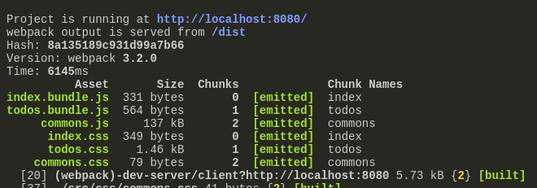

# Webpack2

# Example 6: Multi Page Application

* 2 file html: `index.html` và `todos.html`. Mỗi file có phần css và js riêng
* `./src/css/commons.css` là phần css chung áp dụng cho cả 2 html files
* Trong `./src/js/app.js`, như cũ `app.js` sẽ chứa code css và js cho file `index.html`, thêm file css mới `commons.css` vào
```js
// common chunk between index.html and todos.html
import '../css/commons.css';
```
* `./src/js/todos.js` phụ trách codes cho `todos.html`, ngoài code js sẵn có, cần gọi các file css sẽ sử dụng cho `todos.html`
```js
// common chunk between index.html and todos.html
import '../css/commons.css';
// css of todos.html
import '../css/todos.css';
```

#### Cập nhật webpack.config.js cho multi entry
* File app.js sẽ là entry cho output index.bundle.js và todos.js sẽ là entry cho output todos.bundle.js

```js
  entry: {
    index: './src/js/app.js',
    todos: './src/js/todos.js'
  },
  output: {
    filename: '[name].bundle.js',
    path: path.resolve(__dirname, 'dist'),
    publicPath: '/dist'
  },
```

* `CommonsChunkPlugin` sẽ tạo ra 1 file output `commons` chứa các phần code chung giữa các entry files

```js
  plugins: [
    new webpack.optimize.CommonsChunkPlugin({
      name: "commons",
      // (the common chunk name)

      filename: "commons.js",
      // (the filename of the common chunk)

      // minChunks: 3, 
      // (Modules must be shared between 3 entries)

      chunks: ["index", "todos"]
      // (Only use these entries)
    }),
  ]
```

* Dùng `extract-text-webpack-plugin` như ví dụ trước, sẽ tách phần css từ output file dạng js của webpack sang 1 file css riêng. Bây giờ chúng ta có 2 trang html với css khác nhau nên cần tách thành nhiều file css riêng
* Thay vì chỉ config 1 file `style.css`, trong plugins config:
```js
    new ExtractTextPlugin({
      filename: "[name].css"
    }),
```
* Sử dụng `UglifyJsPlugin` để giảm file size
```js
    new webpack.optimize.UglifyJsPlugin({
      // minimize codes
    })
```

* Bundle css files và tách phần css sang file riêng => kết quả cuối cùng



* Link những file này trong trang html
```html
<!--index.html-->
  <link rel="stylesheet" href="./dist/commons.css">
  <link rel="stylesheet" href="./dist/index.css">
  
  <script src="./dist/commons.js"></script>  
  <script src="./dist/index.bundle.js"></script>
```

```html
<!--todos.html-->
  <link rel="stylesheet" href="./dist/commons.css">
  <link rel="stylesheet" href="./dist/todos.css">
  <script src="./dist/commons.js"></script>
  <script src="./dist/todos.bundle.js"></script>
```